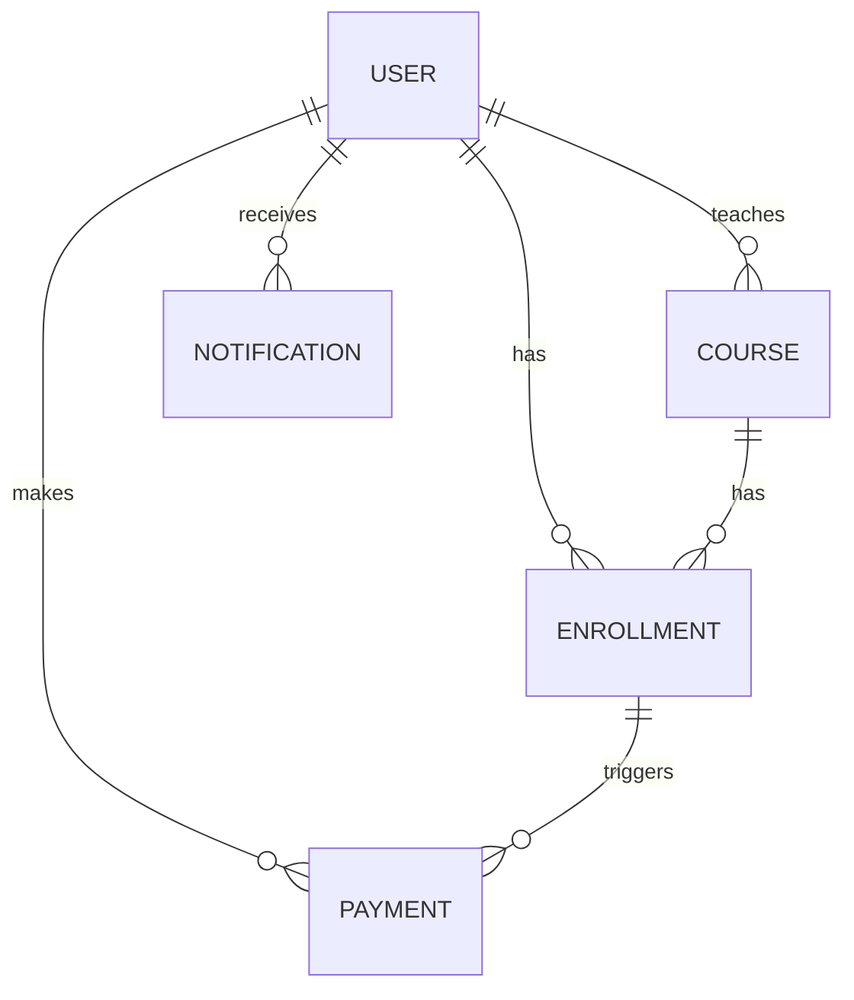

# خريطة الكيانات والعلاقات | Entities & Relationships Diagram (ERD)

## الكيانات الرئيسية | Main Entities
- **User | المستخدم**: طالب، مدرب، مشرف
- **Course | الدورة**: معلومات الدورة، المدرب، السعر
- **Enrollment | التسجيل**: ربط الطالب بالدورة
- **Payment | الدفع**: مدفوعات الاشتراك
- **Notification | الإشعار**: رسائل النظام

---

## رسم تخطيطي للعلاقات (ERD) | ERD Diagram

---

## شرح العلاقات | Relationships Explanation
- **المستخدم (User)** يمكن أن يكون طالبًا أو مدربًا أو مشرفًا.
- **الدورة (Course)** لها مدرب واحد، ويمكن أن يسجل فيها عدة طلاب.
- **التسجيل (Enrollment)** يربط الطالب بالدورة.
- **الدفع (Payment)** مرتبط بالتسجيل أو المستخدم.
- **الإشعار (Notification)** يُرسل للمستخدمين حسب الأحداث.

---

## ملاحظات | Notes
- لا توجد كيانات أو علاقات خاصة بالـ API.
- No API-related entities or relationships.
