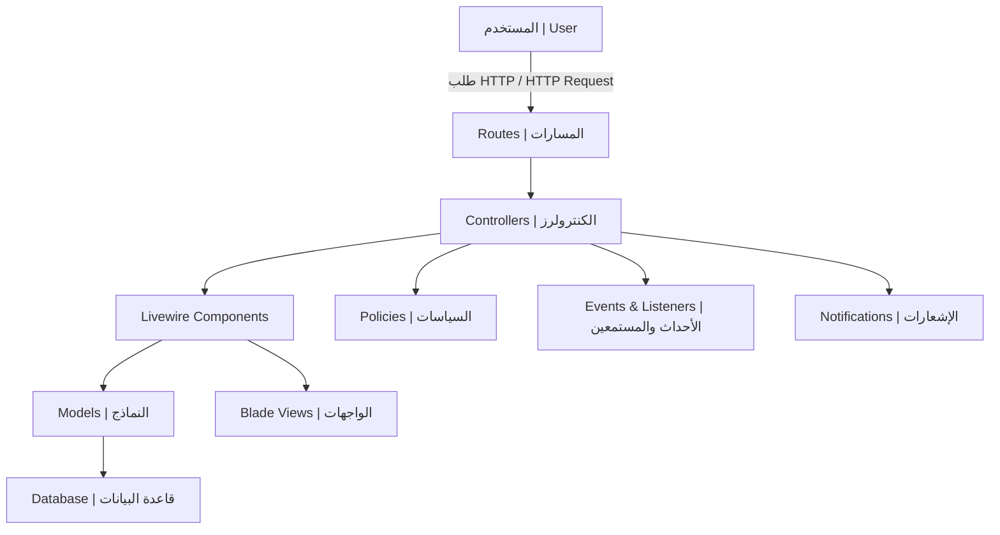

# خريطة معمارية المشروع | Project Architecture Map

## رسم تخطيطي معماري (Mermaid Diagram)

---

## شرح تدفق البيانات | Data Flow Explanation

1. **المستخدم يرسل طلبًا (User sends a request):**
   - الطلب يمر عبر المسارات (Routes) لتحديد الكنترولر المناسب.
   - The request passes through routes to select the appropriate controller.
2. **الكنترولر يعالج الطلب (Controller handles the request):**
   - قد يستدعي مكونات Livewire، ينفذ سياسات (Policies)، أو يطلق أحداثًا (Events).
   - May call Livewire components, execute policies, or fire events.
3. **مكونات Livewire والنماذج (Livewire Components & Models):**
   - Livewire تتعامل مع منطق الواجهة، النماذج تتعامل مع قاعدة البيانات.
   - Livewire handles UI logic, models interact with the database.
4. **الاستجابة (Response):**
   - النتيجة تُعرض عبر Blade أو Livewire.
   - The result is rendered via Blade or Livewire.

---

## ملاحظات | Notes
- لا يوجد أي جزء خاص بالـ API أو REST.
- No API or REST part exists in this project.
